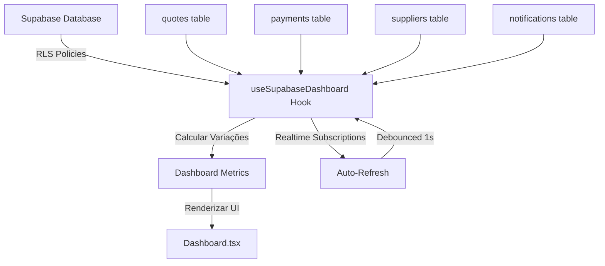

# Dashboard Data Architecture

## 📊 Visão Geral

O dashboard do Cotiz agora utiliza **100% dados reais** do Supabase, com cálculos de variações temporais automáticos e métricas dinâmicas.

---

## ✅ O que foi implementado

### 1. **Hook `useSupabaseDashboard` - Cálculos Dinâmicos**

**Localização:** `src/hooks/useSupabaseDashboard.ts`

#### Novas Métricas Calculadas:

| Métrica | Tipo | Descrição |
|---------|------|-----------|
| `quotesChange` | `number \| null` | % de variação de cotações vs mês anterior |
| `suppliersChange` | `number` | Número de fornecedores cadastrados este mês |
| `spendingChange` | `number \| null` | % de variação de gastos vs mês anterior |
| `completedChange` | `string` | Meta baseada na média dos últimos 3 meses |
| `responseTimeChange` | `number \| null` | % de melhoria/piora no tempo de resposta |

#### Lógica de Cálculo:

```typescript
// Comparação temporal
const previousMonth = currentMonth === 0 ? 11 : currentMonth - 1;
const previousYear = currentMonth === 0 ? currentYear - 1 : currentYear;

// Cálculo de % de mudança
const calculatePercentageChange = (current: number, previous: number): number | null => {
  if (previous === 0) return null; // Primeira vez
  return Math.round(((current - previous) / previous) * 100);
};

// Exemplo: Cotações
const quotesChange = calculatePercentageChange(
  currentMonthQuotes.length, 
  previousMonthQuotes.length
);
```

#### Meta de Concluídas (Média de 3 meses):

```typescript
const last3MonthsCompleted = []; // Array com dados dos últimos 3 meses
const avgLast3Months = Math.round(sum / 3);
const completedChange = `Meta: ${avgLast3Months}`;
```

---

### 2. **Dashboard UI - Textos Dinâmicos**

**Localização:** `src/pages/Dashboard.tsx`

#### Antes (Hardcoded):
```tsx
change="+12% vs mês anterior"  // ❌ Fixo
```

#### Depois (Dinâmico):
```tsx
change={
  metrics.quotesChange !== null 
    ? `${metrics.quotesChange > 0 ? '+' : ''}${metrics.quotesChange}% vs mês anterior`
    : metrics.totalQuotes > 0 
      ? "Primeira vez" 
      : "Nenhuma cotação ainda"
}
```

#### Estados Inteligentes:

| Condição | Texto Exibido |
|----------|---------------|
| `change !== null && > 0` | `+X% vs mês anterior` (verde) |
| `change !== null && < 0` | `-X% vs mês anterior` (vermelho/amarelo) |
| `change === null && total > 0` | `"Primeira vez"` (neutro) |
| `change === null && total === 0` | `"Nenhuma cotação ainda"` (neutro) |

---

### 3. **Métricas Específicas Implementadas**

#### 3.1. Total de Cotações
- **Variação:** Comparação com mês anterior (%)
- **Estados:** Crescimento positivo, negativo, ou primeira vez

#### 3.2. Fornecedores Ativos
- **Variação:** Número absoluto de novos fornecedores este mês
- **Exemplo:** `"+3 este mês"` ou `"Nenhum novo este mês"`

#### 3.3. Gasto Mensal
- **Variação:** Comparação com mês anterior (%)
- **Lógica invertida:** Gastar **menos** é **positivo** (verde)
- **Estados:** Economia, aumento, ou primeira vez

#### 3.4. Concluídas
- **Meta:** Média dos últimos 3 meses
- **Exemplo:** `"Meta: 15"` baseado em dados históricos reais

#### 3.5. Tempo Médio de Resposta
- **Variação:** Comparação com mês anterior (%)
- **Lógica invertida:** Tempo **menor** é **melhor** (positivo)
- **Estados:** `"Melhorou 15%"` ou `"Piorou 8%"`

#### 3.6. Economia Estimada
- **Cálculo:** 15% do valor total de cotações aprovadas
- **Descrição:** `"Baseado em propostas aceitas"`

---

## 🗑️ Mock Data Deprecado

### Arquivo `src/data/mockData.ts`

✅ **Status:** Marcado como **DEPRECATED**

```typescript
/**
 * ⚠️ DEPRECATED - Mock Data File
 * 
 * ✅ TODO: Este arquivo será removido após migração completa.
 * 
 * ❌ NÃO USE em produção.
 * Use: useSupabaseDashboard, useSupabaseQuotes, etc.
 */
```

**Ação futura:** Remover após confirmação de que nenhum componente legado depende deste arquivo.

---

## 📈 Fluxo de Dados



---

## 🎯 Como Adicionar Nova Métrica

### Passo 1: Atualizar Interface
```typescript
// src/hooks/useSupabaseDashboard.ts
interface DashboardMetrics {
  // ... existentes
  newMetric: number;
  newMetricChange: number | null;
}
```

### Passo 2: Implementar Cálculo
```typescript
// Dentro de fetchDashboardData()
const currentMonthData = data.filter(/* filtro mês atual */);
const previousMonthData = data.filter(/* filtro mês anterior */);

const newMetric = currentMonthData.length;
const newMetricChange = calculatePercentageChange(
  currentMonthData.length,
  previousMonthData.length
);

setMetrics({
  // ... existentes
  newMetric,
  newMetricChange,
});
```

### Passo 3: Adicionar no Dashboard
```tsx
// src/pages/Dashboard.tsx
<MetricCard
  title="Nova Métrica"
  value={metrics.newMetric}
  change={
    metrics.newMetricChange !== null 
      ? `${metrics.newMetricChange > 0 ? '+' : ''}${metrics.newMetricChange}% vs mês anterior`
      : "Primeira vez"
  }
  changeType={metrics.newMetricChange > 0 ? "positive" : "negative"}
  icon={MyIcon}
  description="Descrição da métrica"
/>
```

---

## 🔒 Segurança & Performance

### RLS (Row Level Security)
- ✅ Todos os dados respeitam políticas RLS do Supabase
- ✅ Admin vê **todos** os dados
- ✅ Cliente vê apenas **seu** dados
- ✅ Fornecedor vê apenas **suas** cotações

### Performance
- ✅ `Promise.all()` para buscar dados em paralelo
- ✅ Debouncing de 1s em subscriptions realtime
- ✅ Cache automático do React Query (se configurado)
- ✅ Cálculos otimizados com `filter()` e `reduce()`

### Logs de Debug
```typescript
console.log('📈 Dashboard: Calculating metrics...');
console.log('✅ Dashboard: Data fetched successfully', {
  quotes: quotes.length,
  payments: payments.length,
  suppliers: suppliers.length,
});
```

---

## 🧪 Testes Manuais

### Cenário 1: Banco Vazio (Primeira Vez)
- **Resultado esperado:** Todos os campos mostram "Primeira vez" ou "Nenhum dado ainda"
- **Variações:** `null` (não há mês anterior para comparar)

### Cenário 2: Crescimento Positivo
1. Criar cotações no mês atual
2. **Resultado esperado:** `"+X% vs mês anterior"` (verde)

### Cenário 3: Decrescimento
1. Ter mais cotações no mês passado que no atual
2. **Resultado esperado:** `"-X% vs mês anterior"` (vermelho)

### Cenário 4: Meta de Concluídas
1. Criar cotações aprovadas nos últimos 3 meses
2. **Resultado esperado:** `"Meta: X"` baseado na média real

---

## 📚 Referências

### Arquivos Principais:
- `src/hooks/useSupabaseDashboard.ts` - Hook de dados
- `src/pages/Dashboard.tsx` - UI principal
- `src/components/dashboard/MetricCard.tsx` - Componente de métrica
- `src/data/mockData.ts` - **DEPRECATED**

### Hooks Relacionados:
- `useSupabaseQuotes` - Cotações específicas
- `useSupabaseCurrentClient` - Dados do cliente atual
- `useSupabasePlanDetails` - Detalhes do plano de assinatura

---

## ✅ Checklist de Validação

- [x] Variações percentuais calculadas dinamicamente
- [x] Estados vazios tratados
- [x] Textos hardcoded removidos
- [x] Mock data marcado como DEPRECATED
- [x] Performance otimizada com Promise.all()
- [x] Realtime subscriptions funcionando
- [x] Logs de debug implementados
- [x] Documentação criada

---

## 🚀 Próximos Passos (Opcional)

### Fase 2: Outros Dashboards
- [ ] AdminDashboard com dados reais
- [ ] SupportDashboard com sistema de tickets
- [ ] SupplierDashboard revisão

### Fase 3: Limpeza Final
- [ ] Remover completamente `mockData.ts`
- [ ] Buscar e substituir imports de mock data

---

**Última atualização:** $(date)  
**Responsável:** Lovable AI  
**Status:** ✅ Implementado
