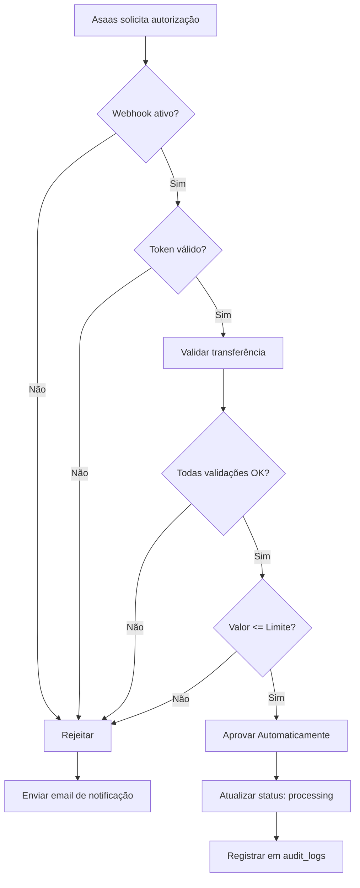

# Configuração do Webhook de Autorização de Transferências Asaas

Este guia explica como configurar o webhook de autorização automática de transferências para fornecedores no Asaas.

## 📋 Pré-requisitos

- Conta ativa no Asaas (Sandbox ou Produção)
- Integração Asaas já configurada no sistema
- Acesso ao painel administrativo do Cotiz

---

## 🔧 Configuração no Cotiz

### 1. Acessar Painel de Administração

1. Faça login como administrador
2. Navegue até: **Admin → Integrações e APIs → Integrações de Pagamento**
3. Role até a seção **"Webhook de Autorização de Transferências"**

### 2. Configurar o Webhook

#### **URL do Webhook**
```
https://bpsqyaxdhqejozmlejcb.supabase.co/functions/v1/approve-transfer-webhook
```
Esta URL já está pré-configurada e não deve ser alterada.

#### **Gerar Token de Autenticação**
1. Clique no botão **"Gerar Token"** (ícone de refresh)
2. Um token único será gerado automaticamente
3. **IMPORTANTE:** Copie este token - você precisará dele para configurar no Asaas

#### **Configurações Adicionais**

| Campo | Descrição | Padrão |
|-------|-----------|--------|
| **Webhook Ativo** | Habilitar/desabilitar autorização automática | ❌ Desativado |
| **Email de Notificação** | Email para receber alertas de transferências rejeitadas | - |
| **Valor Máximo** | Limite para aprovação automática | R$ 50.000,00 |
| **Validar Chave PIX** | Verificar se chave PIX corresponde ao cadastro | ✅ Ativado |

3. Clique em **"Salvar Configurações"**

---

## 🔗 Configuração no Painel Asaas

### 1. Acessar Configurações de Segurança

**Sandbox:**
1. Acesse: https://sandbox.asaas.com
2. Menu: **Transferências → Mecanismos de Segurança**

**Produção:**
1. Acesse: https://www.asaas.com
2. Menu: **Transferências → Mecanismos de Segurança**

### 2. Configurar Webhook de Autorização

1. Clique em **"Webhook de Autorização"** ou **"Configurar Webhook"**
2. Preencha os campos:

   **URL do Webhook:**
   ```
   https://bpsqyaxdhqejozmlejcb.supabase.co/functions/v1/approve-transfer-webhook
   ```

   **Token de Autenticação:**
   - Cole o token gerado no passo anterior do Cotiz
   - Formato: `xxxxxxxx-xxxx-xxxx-xxxx-xxxxxxxxxxxx`

3. **Salvar Configurações**

### 3. Desabilitar Token SMS (Opcional)

Após configurar o webhook:
- **Sandbox:** Abra um ticket no suporte do Asaas informando que configurou o webhook
- **Produção:** Entre em contato com seu gerente de conta

---

## ✅ Validações Automáticas

O webhook realiza as seguintes validações antes de aprovar uma transferência:

### ✓ Validações Obrigatórias

| Validação | Descrição |
|-----------|-----------|
| **Valor Correspondente** | Verifica se o valor da transferência corresponde ao registrado no sistema |
| **Status Pendente** | Confirma que a transferência está aguardando aprovação |
| **Fornecedor Ativo** | Valida que o fornecedor está cadastrado e ativo no sistema |
| **Valor Positivo** | Garante que o valor é maior que zero |

### ✓ Validações Configuráveis

| Validação | Descrição |
|-----------|-----------|
| **Limite de Valor** | Rejeita transferências acima do valor máximo configurado |
| **Chave PIX** | Verifica se a chave PIX corresponde aos dados bancários cadastrados |

---

## 🧪 Testar Webhook

### Teste Automático

1. No painel Cotiz, na seção do webhook
2. Clique no botão **"Testar Webhook"**
3. O sistema irá:
   - Verificar se o webhook está configurado corretamente
   - Validar o token de autenticação
   - Simular uma requisição do Asaas
   - Retornar o resultado do teste

### Teste Real

Para testar com uma transferência real:

1. Crie uma solicitação de transferência para um fornecedor
2. O valor deve estar **abaixo** do limite configurado
3. Aguarde a solicitação de autorização do Asaas
4. Verifique os logs do sistema em: **Admin → Auditoria**

---

## 🔒 Segurança

### Proteções Implementadas

- ✅ **Autenticação por Token:** Todas as requisições devem incluir o token correto
- ✅ **Validação de Origem:** Apenas requisições do Asaas são aceitas
- ✅ **Rejeição por Padrão:** Em caso de erro, a transferência é rejeitada
- ✅ **Logs de Auditoria:** Todas as ações são registradas
- ✅ **Validação de Dados:** Múltiplas verificações de segurança

### Limite de Valores

Transferências acima do **Valor Máximo para Aprovação Automática** serão:
- ❌ Rejeitadas automaticamente
- 📧 Notificação enviada ao email configurado
- 👤 Exigem aprovação manual no painel

---

## 📊 Fluxo de Aprovação



---

## 📝 Logs e Auditoria

Todas as ações do webhook são registradas em:
- **Tabela:** `audit_logs`
- **Ação:** `TRANSFER_AUTO_APPROVED` ou `TRANSFER_AUTO_REJECTED`
- **Painel:** Admin → Auditoria

### Informações Registradas

- ID da transferência Asaas
- Fornecedor e valor
- Resultado de cada validação
- Motivo de rejeição (se aplicável)
- Timestamp da operação

---

## ⚠️ Troubleshooting

### Webhook não está funcionando

1. **Verificar se está ativo:**
   - Painel Cotiz → Webhook Ativo deve estar ✅
   
2. **Validar token:**
   - Token no Asaas deve corresponder ao token gerado no Cotiz
   - Token deve estar no formato UUID correto

3. **Testar conexão:**
   - Use o botão "Testar Webhook" no painel
   - Verifique mensagem de erro retornada

### Transferências sendo rejeitadas

1. **Verificar limite de valor:**
   - Confirme se o valor está dentro do limite configurado

2. **Validar dados bancários:**
   - Verifique se a chave PIX do fornecedor está correta
   - Confirme que os dados bancários estão completos

3. **Consultar logs:**
   - Acesse Admin → Auditoria
   - Filtre por `TRANSFER_AUTO_REJECTED`
   - Verifique o motivo da rejeição

---

## 📞 Suporte

Em caso de dúvidas ou problemas:

- **Email de Notificação:** Configure para receber alertas automáticos
- **Logs do Sistema:** Sempre consultável em tempo real
- **Auditoria Completa:** Todas as operações são rastreáveis

---

## 🔄 Atualizações

**Versão:** 1.0  
**Última atualização:** Novembro 2025  
**Próximas melhorias:**
- Dashboard de estatísticas de aprovações/rejeições
- Regras personalizadas por fornecedor
- Notificações em tempo real via WhatsApp
