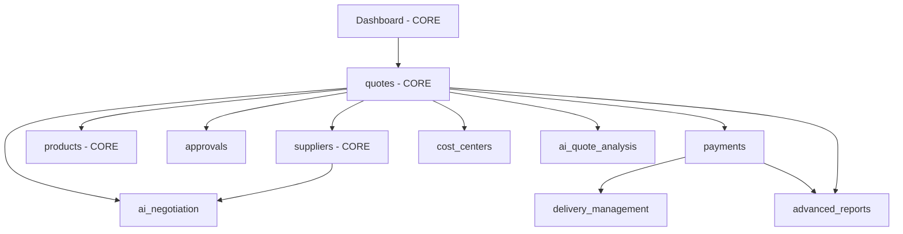

# Arquitetura de Módulos - QuoteMaster Pro

## 1. Visão Geral

O QuoteMaster Pro possui uma arquitetura modular que permite habilitar/desabilitar funcionalidades com base no plano de assinatura. Este documento mapeia **todos os módulos, suas dependências e regras de negócio**.

---

## 2. Taxonomia de Módulos

### 2.1 Módulos CORE (Essenciais - Sempre Habilitados)

Estes módulos são **OBRIGATÓRIOS** e não podem ser desabilitados, pois formam a base do sistema:

| Módulo | Key | Rota(s) | Dependências | Descrição |
|--------|-----|---------|--------------|-----------|
| **Dashboard** | `dashboard` | `/dashboard` | Nenhuma | Visão geral e KPIs |
| **Cotações** | `quotes` | `/quotes` | `suppliers` | **Funcionalidade central**: criar, enviar e gerenciar cotações |
| **Fornecedores** | `suppliers` | `/suppliers` | Nenhuma | Cadastro e gestão de fornecedores |
| **Produtos/Itens** | `products` | `/products` | Nenhuma | Catálogo de itens para cotações |

**Regra de Negócio**: Estes 4 módulos formam o MVP e **NUNCA** podem ser desabilitados.

---

### 2.2 Módulos AVANÇADOS (Opcionais)

| Módulo | Key | Rota(s) | Dependências | Descrição |
|--------|-----|---------|--------------|-----------|
| **Aprovações** | `approvals` | `/approvals`, `/approval-levels` | `quotes` | Fluxo de aprovação de cotações |
| **Pagamentos** | `payments` | `/payments` | `quotes`, `suppliers` | Gestão de pagamentos e faturamento |
| **Gestão de Entregas** | `delivery_management` | Integrado em `/payments` | `payments`, `quotes` | Controle de entregas com códigos de confirmação |
| **Centros de Custo** | `cost_centers` | `/cost-centers` | `quotes` | Organização financeira por centro de custo |
| **Relatórios Avançados** | `advanced_reports` | `/reports` | `quotes`, `payments` | Dashboards e análises detalhadas |
| **Usuários e Permissões** | `user_management` | `/users`, `/permissions` | Nenhuma | Controle de acesso e perfis de usuários |

**Regras de Dependência**:
- `delivery_management` → depende de `payments`
- `cost_centers` → depende de `quotes`
- `advanced_reports` → depende de `quotes` + `payments`

---

### 2.3 Módulos IA (Inteligência Artificial)

| Módulo | Key | Rota(s) | Dependências | Descrição |
|--------|-----|---------|--------------|-----------|
| **Negociação IA** | `ai_negotiation` | `/ai-negotiations` | `quotes`, `suppliers` | IA negocia automaticamente com fornecedores |
| **Análise de Cotações IA** | `ai_quote_analysis` | Integrado em `/quotes` | `quotes` | Análise inteligente de propostas e recomendações |

**Regras de Dependência**:
- `ai_negotiation` → depende de `quotes` + `suppliers`
- `ai_quote_analysis` → depende de `quotes`

---

### 2.4 Módulos PREMIUM (Recursos Exclusivos)

| Módulo | Key | Rota(s) | Dependências | Descrição |
|--------|-----|---------|--------------|-----------|
| **Marca Personalizada** | `custom_branding` | `/settings` (seção) | Nenhuma | Logo, cores e identidade visual customizada |
| **Integração WhatsApp** | `whatsapp_integration` | Configurado em `/settings` | Nenhuma | Notificações e comunicação via WhatsApp |
| **Suporte Prioritário** | `priority_support` | `/communication` | Nenhuma | Tickets com SLA diferenciado |
| **Planos e Assinaturas** | `subscription_management` | `/plans` | Nenhuma | Gestão de planos (apenas ADMIN) |

---

### 2.5 Módulos de COMUNICAÇÃO

| Módulo | Key | Rota(s) | Dependências | Descrição |
|--------|-----|---------|--------------|-----------|
| **Comunicação/Tickets** | `communication` | `/communication` | Nenhuma | Sistema de tickets de suporte |

---

### 2.6 Módulos de SISTEMA (Configurações)

| Módulo | Key | Rota(s) | Dependências | Descrição |
|--------|-----|---------|--------------|-----------|
| **Ajuda** | `help` | `/help` | Nenhuma | Central de ajuda e documentação |
| **Configurações** | `settings` | `/settings` | Nenhuma | Configurações do sistema e preferências |

---

## 3. Matriz de Dependências



---

## 4. Planos Sugeridos e Módulos

### Plano BÁSICO (`plan-basic`)
**Módulos Habilitados**:
```json
[
  "dashboard",
  "quotes", 
  "suppliers",
  "products",
  "communication",
  "help",
  "settings"
]
```

### Plano PROFISSIONAL (`plan-pro`)
**Módulos Habilitados**: BÁSICO +
```json
[
  "approvals",
  "payments",
  "cost_centers",
  "user_management",
  "advanced_reports"
]
```

### Plano EMPRESARIAL (`plan-enterprise`)
**Módulos Habilitados**: PROFISSIONAL +
```json
[
  "ai_negotiation",
  "ai_quote_analysis",
  "delivery_management",
  "custom_branding",
  "whatsapp_integration",
  "priority_support",
  "subscription_management"
]
```

---

## 5. Regras de Exibição de UI

### 5.1 Sidebar (Menu Lateral)

O `AppSidebar.tsx` deve **filtrar** itens de menu baseado nos módulos habilitados:

```typescript
// Exemplo de lógica
const { enabledModules } = useModuleAccess();

const filteredNavigationItems = navigationItems.filter(item => 
  !item.requiredModule || enabledModules.includes(item.requiredModule)
);
```

### 5.2 Rotas Protegidas

Cada rota deve validar se o módulo está habilitado:

```typescript
<ProtectedRoute allowedRoles={['client', 'manager']} requiredModule="payments">
  <PaymentsPage />
</ProtectedRoute>
```

### 5.3 Componentes Condicionais

Dentro de páginas, recursos opcionais devem checar acesso:

```typescript
const { hasAccess } = useModuleAccess('ai_negotiation');

{hasAccess && (
  <AINegotiationButton quoteId={quote.id} />
)}
```

---

## 6. Implementação Técnica

### 6.1 Hook `useModuleAccess`

Já implementado em `src/hooks/useModuleAccess.ts`:
- Faz cache de 5 minutos
- Retorna `hasAccess`, `isLoading`, `enabledModules`

### 6.2 Constantes de Módulos

Em `src/constants/modules.ts`:
- Define `AVAILABLE_MODULES` com metadata
- Organiza por categoria (core, advanced, ai, premium)

### 6.3 Componente `ModuleGuard` (a criar)

Componente HOC para proteger features:
```typescript
<ModuleGuard requiredModule="ai_negotiation" fallback={<UpgradePrompt />}>
  <AIFeature />
</ModuleGuard>
```

---

## 7. Checklist de Implementação

- [ ] Atualizar `AppSidebar.tsx` para filtrar itens baseado em módulos
- [ ] Criar `ModuleGuard` component
- [ ] Adicionar `requiredModule` em todas as rotas
- [ ] Implementar badges de "Premium" em features pagas
- [ ] Criar modal de upgrade quando usuário tenta acessar módulo bloqueado
- [ ] Adicionar validação no backend (RLS policies) por módulo
- [ ] Documentar no Help quais features estão disponíveis por plano

---

## 8. Segurança e Validação

### 8.1 Frontend (UI)
- Esconder elementos de menu não disponíveis
- Desabilitar botões de features bloqueadas
- Mostrar prompts de upgrade

### 8.2 Backend (Supabase)
- RLS policies devem validar se o plano do usuário permite a operação
- Edge Functions devem checar `subscription_plans.enabled_modules`
- Audit logs para tentativas de acesso não autorizado

---

## 9. Mensagens ao Usuário

### Quando módulo está desabilitado:
```
📦 Este recurso não está disponível no seu plano atual.

Faça upgrade para o plano [NOME_PLANO] para desbloquear:
- [Funcionalidade 1]
- [Funcionalidade 2]

[Botão: Ver Planos]
```

---

## 10. Casos Especiais

### Admin
- Admins (`role = 'admin'`) têm acesso a **TODOS** os módulos independente do plano
- Rota `/admin/*` é exclusiva para admins

### Fornecedores
- Fornecedores têm acesso limitado:
  - `quotes` (apenas atribuídas a eles)
  - `products` (seu catálogo)
  - `communication`
  - `settings`

---

**Última atualização**: 2025-10-02  
**Versão**: 1.0.0
